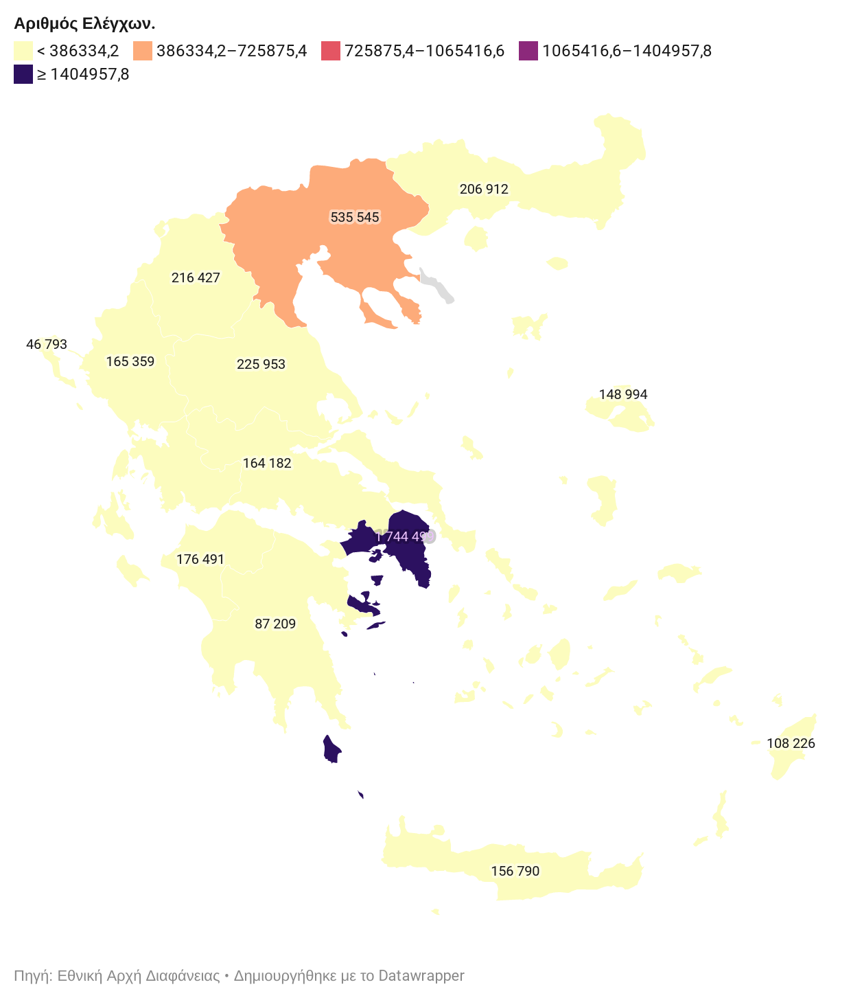

# Αποτίμηση ελέγχων COVID-19 στην Ελλάδα.

_(εάν βλέπετε την σελίδα από συσκευή κινητού, προτιμήστε τον **οριζόντιο προσανατολισμό οθόνης**)_

## Α. Συνολικά Δεδομένα.

_Ημερομηνίες αναφοράς: **6/11/2020 – 04/01/2021**._

<table>
  <tbody>
  <tr>
    <td>Σύνολο ελέγχων στην επικράτεια:</td>
    <td>3.067.240</td>
  </tr>
  <tr>
    <td>Σύνολο παραβάσεων:</td>
    <td>85.755</td>
  </tr>
  <tr>
    <td>Σύνολο προστίμων που επιβλήθηκαν:</td>
    <td>22.198.277€</td>
  </tr>
  <tr>
    <td>Σύνολο επιχειρήσεων των  οποίων η λειτουργία ανεστάλη λόγω παραβίασης:</td>
    <td>174</td>
  </tr>
  <tr>
    <td>Σύνολο κλήσεων στο 1520:</td>
    <td>201.289</td>
  </tr>
  </tbody>
</table>

## Β. Δεδομένα ανά Περιφέρεια.

<table class="has-subtle-light-gray-background-color has-background">
  <tbody>
  <tr>
    <td><b>Περιφέρεια:</b></td>
    <td><b>Έλεγχοι*</b></td>
    <td><b>%</b></td>
    <td><b>Πληθυσμός**</b></td>
    <td><b>%</b></td>
  </tr>
  <tr>
    <td>Ανατ. Μακ. & Θράκη</td>
    <td>159.501</td>
    <td>5%</td>
    <td>608.182</td>
    <td>6%</td>
  </tr>
  <tr>
    <td>Κεντρική Μακεδονία</td>
    <td>399.446</td>
    <td>13%</td>
    <td>1.880.058</td>
    <td>17%</td>
  </tr>
  <tr>
    <td>Δυτική Μακεδονία***</td>
    <td>160.296</td>
    <td>5%</td>
    <td>283.689</td>
    <td>3%</td>
  </tr>
  <tr>
    <td>Ήπειρος***</td>
    <td>129.536</td>
    <td>4%</td>
    <td>336.856</td>
    <td>3%</td>
  </tr>
  <tr><td>Θεσσαλία</td>
    <td>144.319</td>
    <td>5%</td>
    <td>732.762</td>
    <td>7%</td>
  </tr>
  <tr>
    <td>Ιόνιοι Νήσοι</td>
    <td>35.485</td>
    <td>1%</td>
    <td>207.855</td>
    <td>2%</td>
  </tr>
  <tr>
    <td>Δυτική Ελλάδα</td>
    <td>123.115</td>
    <td>4%</td>
    <td>679.796</td>
    <td>6%</td>
  </tr>
  <tr>
    <td>Στερεά Ελλάδα</td>
    <td>119.263</td>
    <td>4%</td>
    <td>547.390</td>
    <td>5%</td>
  </tr>
  <tr>
    <td>Αττική***</td>
    <td>1.401.750</td>
    <td>46%</td>
    <td>3.827.624</td>
    <td>35%</td>
  </tr>
  <tr>
    <td>Πελοπόννησος</td>
    <td>72.609</td>
    <td>2%</td>
    <td>577.903</td>
    <td>5%</td>
  </tr>
  <tr>
    <td>Β. Αιγαίο***</td>
    <td>117.929</td>
    <td>4%</td>
    <td>199.231</td>
    <td>2%</td>
  </tr>
  <tr>
    <td>Ν. Αιγαίο***</td>
    <td>82.462</td>
    <td>3%</td>
    <td>308.975</td>
    <td>3%</td>
  </tr>
  <tr>
    <td>Κρήτη</td>
    <td>121.529</td>
    <td>4%</td>
    <td>623.065</td>
    <td>6%</td>
  </tr>
  <tr>
    <td>Αγ. Όρος</td>
    <td>Ν/Α</td>
    <td>Ν/Α</td>
    <td>1.811</td>
    <td>0%</td>
  </tr>
  <tr>
    <td><b>Σύνολα</b></td>
    <td><b>3.067.240</b></td>
    <td><b>100%</b></td>
    <td><b>10.815.197</b></td>
    <td><b>100%</b></td>
  </tr>
  </tbody>
</table>

_* Οι συνολικοί έλεγχοι ανά περιφέρει προκύπτουν από το άθροισμα των αριθμών που δηλώνονται στο χάρτη της εκάστοτε αναφοράς της Αρχής Διεθνούς Διαφάνειας. Σημειώνουμε ότι το σύνολο των ελέγχων στην επικράτεια προέκυψε από το άθροισμα των συνόλων όλων των περιφερειών για ολόκληρο το διάστημα αναφοράς._

_** Βάση της ελληνικής [απογραφής πληθυσμού 2011](https://el.wikipedia.org/wiki/%CE%95%CE%BB%CE%BB%CE%B7%CE%BD%CE%B9%CE%BA%CE%AE_%CE%B1%CF%80%CE%BF%CE%B3%CF%81%CE%B1%CF%86%CE%AE_2011#%CE%91%CF%80%CE%BF%CE%B3%CF%81%CE%B1%CF%86%CE%AE_%CE%9A%CF%84%CE%B7%CF%81%CE%AF%CF%89%CE%BD_(%CE%A6%CE%B5%CE%B2%CF%81%CE%BF%CF%85%CE%AC%CF%81%CE%B9%CE%BF%CF%82_2011))._

_*** Σε αυτές τις περιφέρειες ο αριθμός ελέγχων είναι κατ' αναλογία μεγαλύτερος ή ίσος από το αντίστοιχο ποσοστό του πληθυσμόυ._

## Γ. Μεθοδολογία.

- Οι παραπάνω οπτικοποιήσεις βασίστηκαν στα δεδομένα που υπάρχουν σε μηχαναγνώσιμη μορφή [στο αποθετήριο covid19gr](https://github.com/akritiko/covid19gr/blob/master/data/csv/covid_checks.csv). 
- Το σύνολο δεδομένων δημιουργήθηκε από χειροκίνητη καταλογογράφηση των αναφορών που ανακοινώνονται σχετικά με την αποτίμηση ελέγχων COVID-19 στην Ελλάδα από την [Εθνική Αρχή Διαφάνειας](https://aead.gr/press/covid19).
- Μπορείτε να βρείτε τον κώδικα του προγράμματος που παράγει τα αποτελέσματα της παραπάνω οπτικοποίησης μαζί με τα ίδια τα δεδομένα της αναφοράς σε μορφή .csv και .json στον φάκελο που βρισκόμαστε. 
- Για τυχόν διορθώσεις ή παρατηρήσεις, παρακαλώ ενημερώστε μας χρησιμοποιώντας [τους τρόπους επικοινωνίας που υπάρχουν εδώ](https://apostolos.kritikos.me/contact/).
